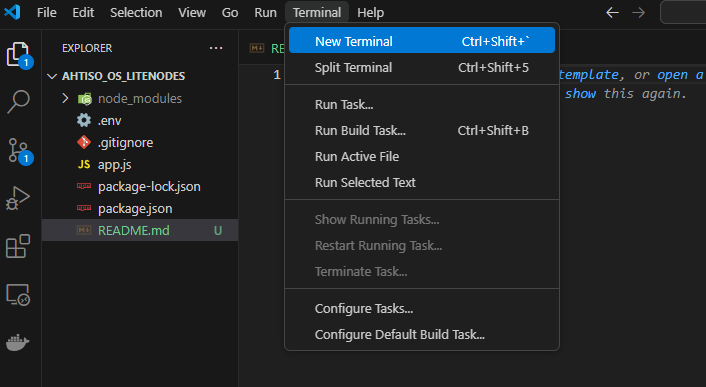

# How to Run a DIOS Node in Visual Studio Code (VS Code)

This guide will walk you through the process of setting up and running this Node.js-based blockchain node program on your computer, even if you have no prior programming experience.

---

## Step 1: Install Required Software

Before running the program, you need to install some software on your computer.

### 1. Install Visual Studio Code (VS Code)
1. Open your web browser and go to the [VS Code official website](https://code.visualstudio.com/).
2. Click on the **Download** button for your operating system (Windows, macOS, or Linux).
3. Once downloaded, open the installation file and follow the instructions to install VS Code. 

### 2. Install Node.js
1. Go to the [official Node.js website](https://nodejs.org/).
2. Click **Download** and install the **LTS (Long-Term Support) version** for your operating system.
3. Open a terminal or command prompt and type the following command to verify the installation:
   ```sh
   node -v
   ```
   You should see a version number displayed.


The image above shows you where to find the terminal in VS Code. 
Open it and type in the command: node -v

4. Similarly, check if npm (Node Package Manager) is installed by typing the command below in the terminal:
   ```sh
   npm -v
   ```


---

## Step 2: Download the Project Files

To run the program, you need to have the project files on your computer.

### 1. Download from GitHub (Simple Method)

1. Go to the project’s GitHub repository page via this link: https://github.com/dios-os/lite-node.git
2. Click the green Code button, then select **Download ZIP**.
3. Once the file finishes downloading, locate it in your Downloads folder.
4. Right-click the file and select **Extract All** (Windows) or double-click to unzip it (macOS/Linux).
5. Open the extracted folder.

---

## Step 3: Open the Project in VS Code
1. Open **Visual Studio Code**.
2. Click **File** > **Open Folder**.
3. Select the project folder from step 3 above. 
4. Click **Select Folder/Open**.

---

## Step 4: Install Required Dependencies
This project requires additional Node.js packages to run.

1. Open **VS Code Terminal**
2. In the terminal, navigate to the project folder if you haven't already:
   ```sh
   cd path/to/project-folder
   ```
3. Run the following command by typing it into the terminal and pressig enter to install dependencies:
   ```sh
   npm install
   ```
4. This will install all necessary dependencies listed in `package.json`.

> If you see an error like `npm not recognized`, restart your computer and try again.

---

## Step 5: Set Up Environment Variables
1. This program requires environment variables. Check that you have a `.env` file in the project folder.

2. The `.env` file should have some data which will be provided to you separately.

---

## Step 6: Run the Program
Now you are ready to run the program!

### 1. Start the Server
1. In the terminal, run:
   ```sh
   npx nodemon src/index.js
   ```

2. You should see an output similar to:
   ```sh
   DIOS Node Activated and Listening on Localhost: 1000.
   Loading Dashboard...

   ```

3. A webpage should open automatically with your node's dashboard. This dashboard provides information about   
   your node, as well as information on the state of the network including the Transaction Pool and Blockchain. 

---

## Step 7: Troubleshooting
If you run into any issues, try these steps:
1. **VS Code or Node.js Not Found?** Restart your computer after installation.
2. **Command Not Recognized?** Ensure Node.js is installed and check your commands carefully. Ensure the right case and symbols.
3. **Dependency Errors?** Run `npm install` again.
5. **Permission Denied?** Try running VS Code as an administrator (Windows) or using `sudo` (Mac/Linux).

---

## Conclusion
You have now successfully set up VS Code and run the DIOS Node Program! If you need further help, contact the project owner or refer to the official documentation of Node.js and VS Code.


